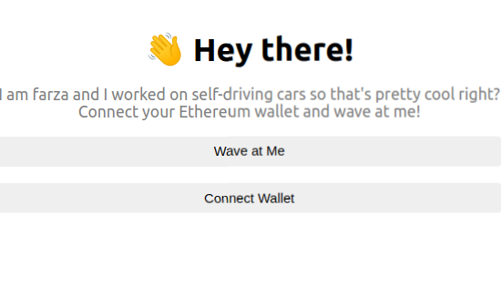

# Build an Ethereum dApp

## Introduction

A website that I'll be calling the WavePortal. It'll be a place where anyone on the internet can learn a little about who you are and send you a 👋 + a message and have that data saved on the blockchain through an Ethereum smart contract.

It was developed following the steps in [buildspace.so](https://buildspace.so/).

## Live demo

https://waveportal-starter-project.dappsar.repl.co

## Technology Stack & Tools

- Visual Studio Code
- nvm / nodejs / npm / npx
- Javascript (React & Testing)
- Solidity (Writing Smart Contracts & Tests)
- [Hardhat](https://hardhat.org/) (Development Framework)
- [Ethers.js](https://docs.ethers.io/v5/) (Blockchain Interaction)
- [React.js](https://reactjs.org/) (Frontend Framework)
- [Metamask](https://metamask.io/)
- QuickNode
- Replit: It is a browser-based IDE that lets us easily build web apps and deploy them all from the browser. It is super legit. Instead of having to set up a full local environment and write commands to deploy, it's all just given to us.

## Requirements For Initial Setup

- Install [NodeJS](https://nodejs.org/en/). Recommended: Use [nvm](https://github.com/nvm-sh/nvm))
- Register an account and Ethereum Test node in [quicknode](https://www.quicknode.com/)
- Set un .env file in root folder with this content:
    * STAGING_QUICKNODE_KEY=(your quicknode url) 
    * PROD_QUICKNODE_KEY=(nothing)
    * PRIVATE_KEY=(your metamask' acoount private key)

## Setting Up
### 1. Clone/Download the Repository
`$ git clone repo_url`

### 2. Install Dependencies
`$ npm install`

### 3. Run tests
`$ npx hardhat test`
`$REPORT_GAS=true npx hardhat test`

### 4. Start Hardhat node
`$ npx hardhat node`

### 5. Run deployment script
In a separate terminal execute:
`$ npx hardhat run ./scripts/deploy.js --network localhost`

### 6. Start frontend
`$ npm run start`

### 7. Simple run (command line)
`$ npx hardhat run ./scripts/run.js` 

## Links

* [Smart Contract deployed in Goerli Test Blockchain](https://goerli.etherscan.io/address/0x7D2dAeb5DddbD49CB88B0679B8D190bb5561c3dd)
* [NFT earned after finishing project in buildspace.so](https://opensea.io/assets/matic/0x5c4E5ae2ADEAD056fD39badCe6A5A0e4ceBec3Ee/5)

